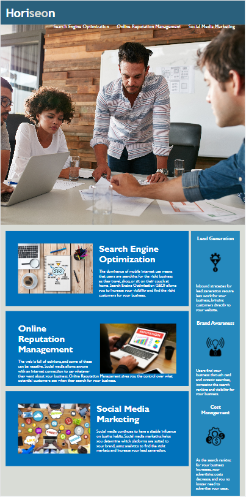

<h1>Module-1 Challenge - Horiseon Social Solution Services, Inc.</h1>

<h2>Description:</h2>

This is a webpage that has semantic elements and a good semantic structure. The CSS selectors and properties are organized to follow the webpage's semantic structure with proper comments.

<h3>Live URL is here:</h3>

https://danfeng-danny-wang.github.io/Module-1-Challenge/

<picture>
  
  

</picture>
